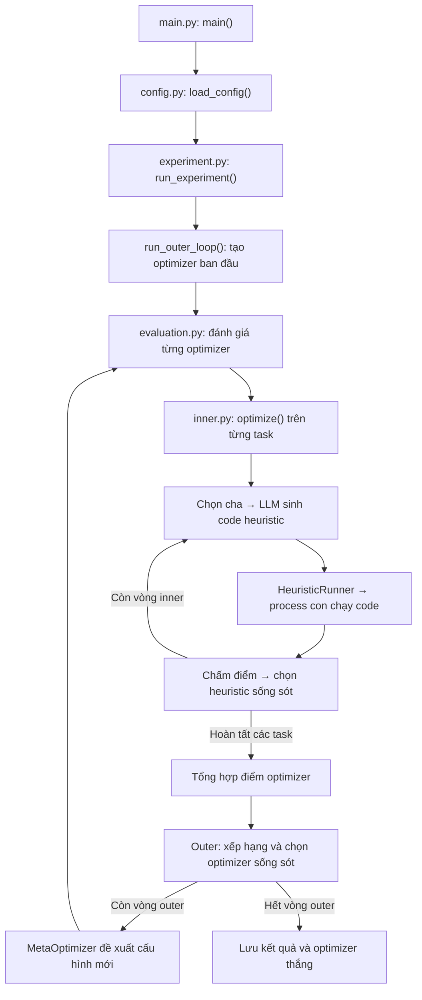

# Mini-MoH

A minimal research implementation inspired by Meta-Optimization of Heuristics,
using Euclidean TSP. Python 3.12, uv, and Linux are required.

The **inner loop** (`HeuristicOptimizer`) searches Python heuristic programs.
The **outer loop** (`MetaOptimizer`) proposes validated configurations of those
optimizers. `LLMClient` supplies text; it is not an optimizer. V0 evolves constrained
optimizer specifications, not arbitrary optimizer Python programs, and makes no
claim to reproduce paper results or outperform established baselines.

## Hướng dẫn đọc code (tiếng Việt)

**Bắt đầu từ `main.py`, rồi đọc `experiment.py` và `optimizers/inner.py`.**
Các file trong `prompts/` chỉ tạo nội dung gửi đến LLM; đọc riêng chúng sẽ khó
thấy luồng hoạt động của hệ thống.

### Ba khái niệm cần phân biệt

Bài toán TSP yêu cầu tìm hành trình đi qua tất cả thành phố rồi quay về điểm
xuất phát. Trong project này:

| Khái niệm | Vai trò | Ví dụ |
| --- | --- | --- |
| **Heuristic** | Một đoạn code chọn thành phố tiếp theo | Chọn thành phố chưa đi gần nhất |
| **HeuristicOptimizer — inner loop** | Tìm kiếm heuristic tốt hơn | Chọn cha → sinh code con → đánh giá → giữ ứng viên tốt |
| **MetaOptimizer — outer loop** | Đề xuất cấu hình cho inner loop | Đổi cách chọn cha, mutation/crossover, reflection hoặc kích thước quần thể |
| **LLMClient** | Cung cấp văn bản đề xuất cho hai tầng tìm kiếm | Trả về code heuristic hoặc JSON cấu hình optimizer |

V0 tìm kiếm **cấu hình optimizer dưới dạng JSON**. Ví dụ:

```json
{
  "parent_selection": "best",
  "generation_operator": "mutate",
  "use_reflection": false,
  "survivor_selection": "elitist",
  "population_size": 3
}
```

Cấu hình này giữ ba heuristic trong quần thể, chọn heuristic tốt nhất làm cha,
nhờ LLM sửa code mà không có bước reflection riêng, rồi giữ các ứng viên có
điểm tốt nhất. `FakeLLM` trả về các mẫu định sẵn để chạy offline; nó không gọi
API và không thực sự suy luận từ prompt.

### Cấu trúc thư mục

```text
EAs_in_ML/
├── configs/                     # Cấu hình thí nghiệm
│   ├── smoke.yaml               # Chạy nhỏ, dùng FakeLLM
│   └── real_llm.yaml            # Cấu hình dùng API thật
├── src/moh/                     # Code chính
│   ├── main.py                  # Điểm bắt đầu khi chạy chương trình
│   ├── config.py                # Đọc và kiểm tra cấu hình
│   ├── experiment.py            # Ghép các thành phần, điều khiển outer loop
│   ├── evaluation.py            # Chấm một optimizer trên nhiều task
│   ├── logging.py               # Lưu kết quả, sự kiện và code được sinh
│   ├── core/                    # Kiểu dữ liệu và quy tắc dùng chung
│   │   ├── models.py            # Heuristic, EvaluationResult, RunResult...
│   │   ├── specs.py             # OptimizerSpec và các ràng buộc hợp lệ
│   │   ├── protocols.py         # Giao diện chung cho Task
│   │   ├── populations.py       # Quần thể và thứ tự xếp hạng
│   │   └── seeds.py             # Sinh seed ổn định
│   ├── problems/                # Bài toán cần giải
│   │   ├── tsp.py               # Sinh tọa độ, kiểm tra tour, tính độ dài
│   │   └── baselines.py         # Code nearest-neighbor và random
│   ├── optimizers/              # Logic tìm kiếm
│   │   ├── inner.py             # Inner loop: tìm heuristic
│   │   ├── selection.py         # Chọn cha và ứng viên sống sót
│   │   ├── seed_optimizers.py   # Hai cấu hình optimizer ban đầu
│   │   └── meta.py              # Đề xuất cấu hình optimizer mới
│   ├── prompts/                 # Tạo chuỗi prompt gửi đến LLM
│   │   ├── heuristic_generation.py
│   │   └── optimizer_generation.py
│   ├── llm/                     # Giao tiếp với nguồn sinh văn bản
│   │   ├── base.py              # Giao diện LLMClient và lỗi chung
│   │   ├── fake.py              # Phản hồi định sẵn để chạy offline
│   │   ├── openai_client.py     # Adapter gọi API thật
│   │   ├── recording.py         # Ghi prompt, response và số lần gọi
│   │   └── parsing.py           # Xử lý code fence trong response
│   └── execution/               # Chạy và đánh giá code heuristic
│       ├── heuristic_runner.py # Đánh giá trên các instance
│       ├── sandbox.py          # Quản lý process, timeout, giới hạn dữ liệu
│       ├── worker.py           # Process con thực sự chạy code
│       └── protocol.py         # JSON trao đổi với process con
├── tests/                       # Ví dụ sử dụng và kiểm thử từng thành phần
├── docs/                        # Spec, plan, ghi nhận triển khai
├── outputs/                     # Kết quả được tạo sau khi chạy
├── pyproject.toml               # Cấu hình package và dependencies
└── uv.lock                      # Phiên bản dependencies đã khóa
```

Các file `__init__.py` hiện chủ yếu đánh dấu thư mục là Python package; có thể
bỏ qua trong lượt đọc đầu tiên.

### Luồng chạy tổng thể



**`meta.py` chỉ đề xuất optimizer mới; vòng lặp outer đầy đủ nằm trong
`experiment.py`.** Mỗi optimizer được đánh giá bằng cách chạy inner loop mới
trên từng task, rồi tổng hợp kết quả. Heuristic được chạy trong process con;
process cha kiểm tra tour và chấm điểm từ tọa độ gốc.

### Thứ tự đọc đề xuất

1. **Đọc cấu hình để biết thí nghiệm sẽ làm gì.**
   Mở [configs/smoke.yaml](configs/smoke.yaml). Chú ý `inner.iterations`,
   `outer.iterations`, `population_size`, `tasks.sizes` và `llm.provider`.
   Một *instance* là một bộ tọa độ cụ thể: TSP10 với ba instance nghĩa là ba
   bài toán khác nhau, mỗi bài có mười thành phố.

2. **Đọc điểm vào và cách ghép hệ thống.**
   Mở [main.py](src/moh/main.py), tìm `main()`, rồi sang
   [experiment.py](src/moh/experiment.py), đọc **`run_experiment()` trước**.
   Hàm này tạo task, runner, LLM và evaluator rồi gọi outer loop. Lượt đầu
   chỉ cần hiểu vai trò từng đối tượng; phần ghi log có thể đọc sau.

3. **Hiểu một heuristic trông như thế nào và được chấm ra sao.**
   Đọc [baselines.py](src/moh/problems/baselines.py), rồi
   [tsp.py](src/moh/problems/tsp.py). Hàm `select_next_node(...)` chỉ chọn
   **một thành phố tiếp theo** mỗi lần được gọi. Worker gọi nó nhiều lần để
   tạo cả hành trình. Utility là âm của độ dài trung bình: `-3` tốt hơn `-5`.
   Một instance thất bại làm cả lần đánh giá heuristic thất bại, với utility
   bằng `None` trong Python và `null` khi lưu JSON.

4. **Đọc phần tìm kiếm heuristic.**
   Mở [inner.py](src/moh/optimizers/inner.py), tìm
   `ConfiguredOptimizer.optimize()`. Theo dõi biến `members`: đó là quần thể
   heuristic hiện tại. Luồng chính là tạo và đánh giá heuristic ban đầu →
   chọn cha → `generate_child()` → đánh giá con → chọn ứng viên sống sót → lặp.
   Đọc [selection.py](src/moh/optimizers/selection.py) khi gặp
   `select_parents()` hoặc `select_survivors()`.

5. **Nối inner loop với outer loop.**
   Đọc [evaluation.py](src/moh/evaluation.py), đặc biệt
   `OptimizerEvaluator.evaluate()`. Hệ thống chạy inner loop của optimizer
   trên từng task, lấy heuristic tốt nhất mỗi task rồi tính điểm tổng hợp.
   Sau đó quay lại `run_outer_loop()` trong `experiment.py`: tạo hai optimizer
   ban đầu → đánh giá → đề xuất cấu hình mới → đánh giá cấu hình mới → chọn
   optimizer sống sót. Mỗi optimizer con được đánh giá trước khi tham gia chọn lọc.

6. **Đọc prompt, LLM và hạ tầng thực thi.**
   [optimizer_generation.py](src/moh/prompts/optimizer_generation.py) tạo
   prompt chứa các optimizer hiện tại, điểm và lượng công việc đã dùng.
   [meta.py](src/moh/optimizers/meta.py) gửi prompt, nhận JSON và kiểm tra bằng
   `OptimizerSpec`. Với inner loop,
   [heuristic_generation.py](src/moh/prompts/heuristic_generation.py) tạo
   prompt yêu cầu ý tưởng hoặc code Python. Sau đó đọc `llm/fake.py`,
   `execution/heuristic_runner.py`, `execution/worker.py`; đọc chi tiết quản lý
   pipe và process trong `execution/sandbox.py` sau cùng.

Khi gặp kiểu dữ liệu chưa hiểu, tra [models.py](src/moh/core/models.py):

| Kiểu dữ liệu | Nội dung cần nhớ |
| --- | --- |
| `Heuristic` | ID, source code và ý tưởng tùy chọn |
| `EvaluationContext` | Task và các seed xác định bối cảnh đánh giá |
| `EvaluationResult` | Trạng thái, utility, độ dài tour và lỗi |
| `ScoredHeuristic` | Heuristic đi kèm kết quả đánh giá |
| `OptimizerCandidate` | ID và `OptimizerSpec` |
| `WorkCounts` | Số lần đánh giá heuristic, thử instance và gọi LLM |
| `RunResult` | Trạng thái thí nghiệm, optimizer thắng và quần thể cuối |

Điểm số nằm trong kết quả đánh giá để một heuristic có thể được đánh giá trong
nhiều bối cảnh khác nhau mà không ghi đè điểm của bối cảnh trước.

### Vừa chạy vừa đọc

Chạy hai heuristic có sẵn trước, rồi chạy cả hai vòng tối ưu bằng FakeLLM:

```bash
uv run python -m moh.main --mode tsp-demo
uv run python -m moh.main --config configs/smoke.yaml
```

Sau lệnh thứ hai, mở thư mục `run_dir` được in ra và đọc theo thứ tự:

1. `run.json`: kết quả và optimizer thắng.
2. `optimizers/`: cấu hình các optimizer đã thử.
3. `heuristics/`: code Python thực sự được đánh giá.
4. `events.jsonl`: diễn biến chi tiết, bao gồm prompt và response.

Nếu dùng debugger, đặt breakpoint lần lượt tại `run_experiment()`,
`run_outer_loop()`, `OptimizerEvaluator.evaluate()` và
`ConfiguredOptimizer.optimize()`. Theo dõi bốn biến **`population`, `members`,
`parents`, `child`** để thấy hai tầng tìm kiếm. Code heuristic chạy trong process
con riêng nên debugger của process cha không tự động bước vào đoạn code đó.

Có thể đọc test song song như các ví dụ sử dụng nhỏ:

| Muốn hiểu | Đọc test |
| --- | --- |
| Sinh bài toán và tính độ dài tour | [test_tsp.py](tests/test_tsp.py) |
| Chọn cha, chọn ứng viên sống sót | [test_selection.py](tests/test_selection.py) |
| Một optimizer tìm kiếm heuristic | [test_inner_loop.py](tests/test_inner_loop.py) |
| Chấm optimizer trên nhiều task | [test_optimizer_evaluation.py](tests/test_optimizer_evaluation.py) |
| Vòng tìm kiếm optimizer | [test_outer_loop.py](tests/test_outer_loop.py) |
| Thí nghiệm hoàn chỉnh và tính tái lập | [test_smoke.py](tests/test_smoke.py) |

## Run offline

```bash
uv sync --locked
uv run python -m moh.main --mode tsp-demo
uv run python -m moh.main --config configs/smoke.yaml
uv run ruff check .
uv run pytest -q
```

The smoke configuration uses FakeLLM, seed 42, TSP10 and TSP20 with three instances
each, two inner iterations, two outer iterations, inner capacity three, and outer
capacity two. TSP50 is also supported. Zero iterations still evaluate the seed
populations. CLI exit codes: 0 success, 1 all candidates failed, 2 configuration or
infrastructure error. Output paths are relative to the current working directory.
All tests run offline; provider tests inject transport stubs.

## Search and scores

Each heuristic defines
`select_next_node(current_node, unvisited, coordinates) -> int`.
The worker starts at city 0, supplies sorted unvisited cities, visits every city
once, and closes the tour. The trusted parent validates the complete tour and
scores original coordinates. Mutation of worker inputs cannot alter scoring.
Nearest-neighbor ties choose the smallest city index; random baselines have
independent policy seeds.

Utility is negative mean tour length: higher is better. One failed instance
fails the candidate; failed utility is JSON `null`, never Infinity or NaN.
Successful candidates always rank above failures, with candidate ID breaking ties.
Optimizer utility is the positive weighted mean of its best successful heuristic
on every task. Any task without a successful heuristic fails the optimizer.
Weights default to equal and must match the task list. Scores are raw lengths,
not normalized across sizes.

Optimizer specs support random/best/tournament parent selection, mutation or
two-distinct-parent crossover, optional idea-then-code reflection, elitist or exact
source-hash diversity survival, and inner capacities 2–10. Diversity prefers unique
successful sources, fills with successful duplicates, then considers failures.
Returned populations are score ordered. Every outer child is evaluated before
selection, including the final child. Identical specs are reevaluated; no cache is
used. Different population sizes and reflection settings consume different work;
records include actual evaluation, instance-attempt, and LLM-call counts.

## Execution limits

Generated code, including module-level statements, runs only in a fresh child
process per instance. Default limits are 64 KiB source, 1 MiB result JSON, 64 KiB
combined stdout/stderr, and a five-second wall-clock deadline per instance.
Nonblocking pipes and process-group cleanup contain output floods, crashes, and
hangs. Linux subreaper support cleans up orphaned descendants in the worker group.
The process-wide subreaper setting remains enabled; reaping is restricted to each
worker's process group. This implementation assumes sequential experiments.

This is crash/timeout containment for locally controlled experiments, **not a
security sandbox**. Generated Python can access the filesystem and network and
could escape its process group. Prompts forbid imports and IO but do not enforce
those restrictions. Adversarial programs require stronger OS isolation.

## Reproducibility and artifacts

Seed derivation is exactly:

```python
payload = json.dumps([root, *labels], ensure_ascii=True, separators=(",", ":"))
seed = int.from_bytes(hashlib.sha256(payload.encode("utf-8")).digest()[:4], "big")
```

Labels distinguish tasks, instances, candidate policy seeds, search generations,
and evaluation repetitions. All comparable heuristics use the same worker seed
schedule; optimizer identity affects lineage IDs, not comparison RNGs. Every
task/optimizer pair gets a fresh population and a fresh FakeLLM with independent
per-kind response cursors. Both Python and NumPy worker RNGs are seeded.

Each unique directory under `outputs/` contains:

- `config.yaml`: resolved configuration, including equal default weights.
- `run.json`: terminal status, winner, population, dependency versions and Git revision.
- `events.jsonl`: ordered strict JSON records with sources, lineage, contexts, seeds,
  prompts, responses, generation failures, scores, populations, and work counts.
- `heuristics/<id>.py`: every evaluated heuristic source, including failed programs.
- `optimizers/<id>.json`: every evaluated optimizer specification.

Fake runs reproduce sources, decisions, scores, winners, and event order. Unique
run-directory names and output paths are excluded from comparisons; runtime
versions and revision describe the execution environment. Artifact write failures
abort the run instead of becoming candidate failures. No environment dump or API
key is recorded.

## Real provider

Replace `YOUR_MODEL_NAME` in `configs/real_llm.yaml` with a model available to your
account, set `OPENAI_COMPAT_API_KEY` in your environment, then run:

```bash
uv run python -m moh.main --config configs/real_llm.yaml
```

The adapter uses the [official Responses API Python interface](https://developers.openai.com/api/docs/libraries),
with explicit request timeouts, SDK automatic retries disabled, and at most three
attempts for transient errors. Provider-specific SDK and credential handling live
only in `src/moh/llm/openai_client.py`. Permanent errors and malformed responses do
not retry. Prompts/responses and per-attempt model/usage records are retained;
known credentials are redacted at the adapter boundary.

Live responses are not seed-reproducible. Retained responses support auditing and
future replay tooling; an automated replay command is outside v0. No live-provider
validation was performed during implementation. Mocked tests do not establish
account or model access.

## Design

See the [specification](docs/superpowers/specs/2026-09-23-mini-moh-design.md) and
[implementation plan](docs/superpowers/plans/2026-09-24-mini-moh-v0.md).
Generated optimizer programs, hostile-code isolation, held-out evaluation,
equal-budget comparisons, and upstream paper-result comparisons are follow-up work.
